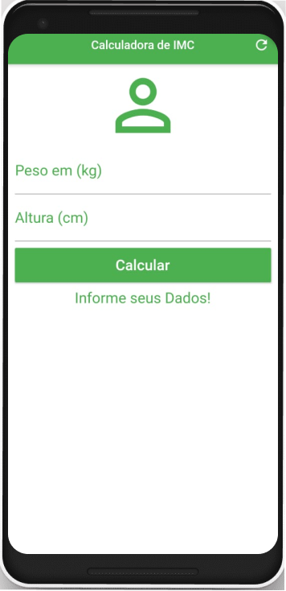

# imc_calculator

Visando aprimorar meus conhecimentos decidi buscar  novas experiências para minha carreira profissional.
E dessa vez  escolhi o Flutter para desenvolvimento Mobile Cross-Platform. Iniciei com exercícios bem 
simples, mas que me trariam alguns novos conhecimentos, a exemplo disso desenvolvi essa Calculadora de
IMC(Índice de Massa Corporal) neste exercício eu pude  aprender bastantes conceitos  do Flutter como 
(Widget, column, Row, entre outros), Espero me aprofundar ainda mais em Exemplos mais complexos a fim de 
me profissionalizar  na área e ir em buscas de vagas no mercado de trabalho nesta categoria futuramente.

## Resultado do APP

